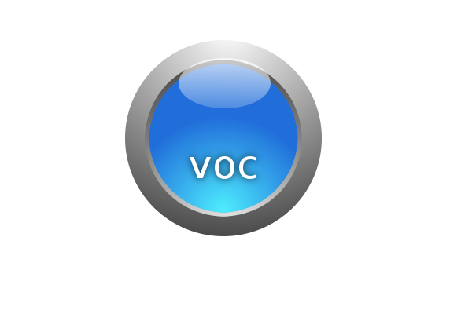

videoOnCloud: storing binary content on cloud.
=============================================

videoOnCloud (or voc) started as a just for fun project to store video on cloud.
However as development continued, we realised we can store beyond just video as
the content is in binary, we can basically store anything on the datastore.

Current supported datastore is cassandra.

## support datastore

currently supported datastore included:

 * cassandra

## How to

to start, see [RunMe.java](src/java/org/just4fun/voc/RunMe.java)

Contributing to voc
======================

Want to learn and contribute back to this project? Send me a message and I will
guide you. :-)

These instructions are probably too little as my time are pretty limited, please
let me know if anything is wrong or incomplete.

### Legal

Use and transfer of videoOnCloud may be subject to certain restrictions by the
Malaysia and other governments.

It is your responsibility to ensure that your use and/or transfer does not
violate applicable laws.

For more information, please see http://www.mcmc.gov.my/

Licensing
=========
videoOnCloud is licensed under the Apache License, Version 2.0.

